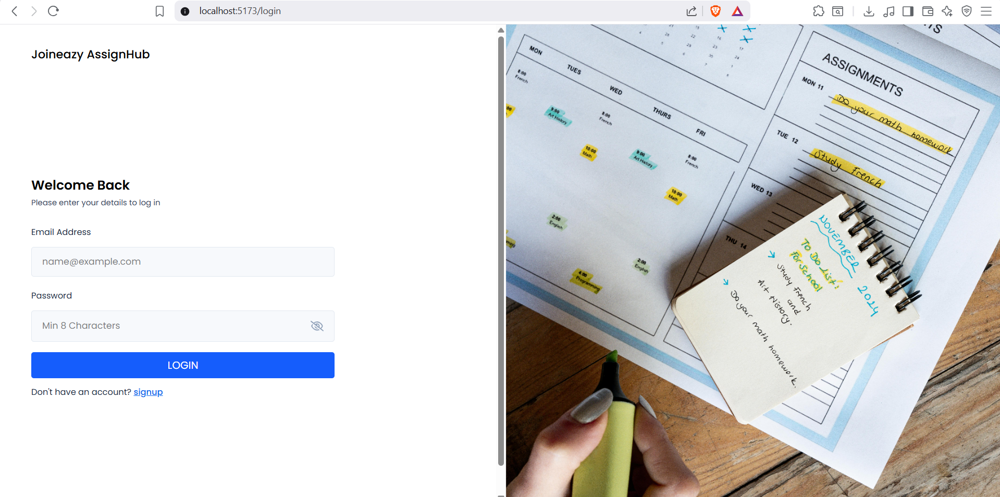

# full-stack-Task Management Application 
***

### AssignHub – Project Implementation Summary

**Overview:**  
AssignHub is a work-in-progress, role-based assignment management system designed to meet the key requirements from the Joineazy technical task. The current implementation focuses on robust role-based access, assignment workflow, and progress analytics, with several core features fully built and others under development.

***
## 📸 Project Preview

### 🔐 Authentication (Login / Signup)

### 📊 Dashboard Overview

### 📝 Create Assignment (Admin)

### 📋 Assignment List (Student View)

### ✅ Submission Workflow

### 📈 Analytics & Progress Tracking

### 📤 Export Reports (Excel)

#### Roles & Authentication

- There are two roles: Admin (Professor) and Student, both authenticated using JWT-based login.
- Multiple admins (professors) can coexist; each can create and manage assignments.
- Each user can only see his/her own tasks or relevant assignment data—group and student privacy enforced.
- Only the assignee(s) (students) and relevant admins see specific group progress and submissions.

***

#### Assignment & Submission Workflow

- Admins create assignments (with title, description, due date, and OneDrive/Drive links).
- Students can view a list of all assignments and access corresponding drive links for submission.
- The system allows students to confirm their own assignment submission in a two-step flow ("Submitted" → confirm), ensuring accurate status.
- Each assignee can only see or confirm their own assignment; privacy is maintained between members.
- Admins can track overall and individual assignment statuses in real-time via dashboards.

***

#### Live Analytics & Visual Reporting

- Live status of assignments and group progress is displayed using graphical charts (Chart.js).
- Visual progress dashboards allow admins and students to see completed/incomplete work at a glance.
- An "Export Report" feature enables generation and one-click download of reports as Excel sheets for both admins and students—facilitating sharing and further analysis.

***

#### Additional Features

- Drive (OneDrive/Google Drive) links are integrated, allowing students to attach and submit files externally, which admins can review.
- The platform supports multiple admins and students.
- Secure module structure: The backend is modular (folders for controllers, routes, models, middlewares, config), and JWT security is enforced.
- The UI is responsive and leverages Tailwind CSS with React components for a clean user experience.

***

#### Technical Stack

- Frontend: React.js, Tailwind CSS, HTML
- Backend: Node.js, Express
- Database: MongoDb
- Other: JWT Authentication, Chart.js for analytics, Excel export for reports
- In-container development (Docker) is planned for deployment.

***

#### Status

- The website is under active development and additional group management features are ongoing.
- All major roles, assignment workflows, tracking, and reporting features are already functional.

***

#### Folder Structure

- The project follows a modular folder structure, as per best practices:
  - `/frontend` and `/backend` separation
  - Backend includes `controllers/`, `models/`, `routes/`, `middlewares/`, `uploads/`, and configuration.
  - Standard files: `.env`, `package.json`, `server.js`, `README.md`, etc.

***

#Setup & Run Instructions-
#Prerequisites:
Node.js (v18+ recommended)
MongoDB (Atlas or local instance)
npm or yarn

#Clone the Repository:
git clone <your-repository-link>
cd AssignHub

#Install dependencies:
cd backend
npm install

#Start the backend server:
npm start

Architecture Overview (Frontend + Backend + DB Flow)
Frontend: React.js app using Tailwind CSS for UI, Axios for HTTP requests. Handles login, registration, dashboard, visualization of assignments/submissions, progress charts, and group management screens.

Backend: Node.js with Express.js REST API. Handles routing, request validation, JWT-based authentication, role checks (student/admin), connects to MongoDB via Mongoose ODM.

Database: MongoDB (schema via Mongoose). Stores users, assignments, groups, and submissions in separate collections.

Data Flow:

User logs in (JWT created) → requests made to Express API

Protected endpoints check JWT and fetch/update/create documents in MongoDB

Assignments and submissions data passed to frontend via API, displayed with progress visualizations and live reporting features

File links (Drive/OneDrive) included as URL fields per assignment

One-click Excel report generation/export for admins via backend

#### Disclaimer

- Group formation/invitation functionality is under construction.

